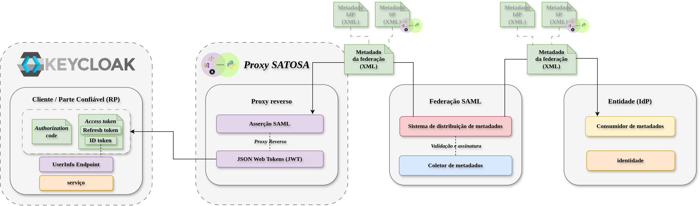

# Experimentação: Federar um Cliente / Parte Confiável (RP) baseado em Keycloak
Esse diretório apresenta um ambiente de experimentação para o uso de SAML em uma federação de identidade. O objetivo é demonstrar como inserir um provedor de serviço OIDC e um proxy OIDC/SAML em uma federação SAML e como essas entidades podem interagir com outras entidades da federação.



## Especificação das funcionalidades
1) Inscrição do SP no proxy
2) Inscrição do proxy na federação

## Especificação das tecnologias

| Papel           | Serviço     | Porta | Entity ID                                                                            |
| --------------- | ----------- | ----- | ------------------------------------------------------------------------------------ |
| Provedor de Serviço OIDC | Keycloak  | 8080  | http://localhost:8080/realms/WTG-SP           |
| Proxy OIDC/SAML    | SATOSA  | 433  |   (interface backend SAML) https://localhost/metadata/saml2/proxy | 
## Prática de Experimentação

### Configuração do provedor de serviço
#### Registrar SP na Federação
1. Crie o realm "WTG-SP" para definir as configurações do SP
2. Os metadados do SP podem ser acessados em http://localhost:8080/realms/WTG-SP/protocol/saml/descriptor


### Configuração do proxy

O SATOSA atua como um proxy de federação fundamentado em uma arquitetura de plugins. Ele utiliza interfaces (*frontends* e *backends*) para realizar a comunicação e a tradução entre diferentes protocolos de identidade. Neste cenário, configuramos um plugin de frontend OIDC (`openid_connect_frontend`) para receber as requisições do Keycloak (atuando como Provedor de Identidade), e um plugin de backend SAML (`saml2_backend`) para intermediar a comunicação com a federação (atuando como Provedor de Serviço).

#### Configuração dos plugins
Ajuste a configuração do plugin `openid_connect_frontend.yaml` para viabilizar a comunicação com o Keycloak. Sendo o Keycloak o Provedor de Serviço (SP / RP) de origem, ele deve ser devidamente registrado como um cliente confiável no arquivo de configuração `clients.json` do SATOSA. 

Em seguida, configure o plugin de backend SAML (`saml2_backend.yaml`) para permitir que o proxy encaminhe as requisições de autenticação para as entidades da federação.
```yaml
metadata:
      remote:
        - url: https://federacao.exemplo.com/metadata/federacao.xml
```

### Preparação do Ambiente
Subir as entidades:
```bash
docker-compose up -d
```

### Fluxo de autenticação

1. O usuário acessa o SP (http://localhost:8080/realms/WTG-SP/account).
2. O SP redireciona para o SATOSA (interface frontend).
3. O SATOSA redireciona para a federação.
4. O usuário se autentica na federação.
5. A federação redireciona o usuário para o SATOSA.
6. O SATOSA redireciona o usuário para o SP.

É possível testar a autenticação pelo link: http://localhost:8080/realms/WTG-SP/account