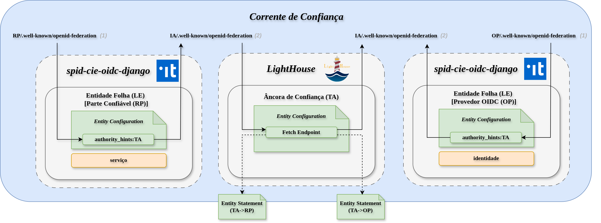

# Experimentação: Montar uma corrente de confiança contendo um Provedor OIDC (OP), uma Parte Confiável (RP) e uma Âncora de Confiança

Este diretório apresenta um ambiente de experimentação para o framework OpenID Federation, com o objetivo de demonstrar a construção de uma corrente de confiança entre diferentes entidades. O cenário inclui uma Âncora de Confiança (Trust Anchor), um Provedor OpenID Connect (OP) e uma Parte Confiável (RP), permitindo observar, na prática, o processo de estabelecimento de confiança, registro de entidades e emissão de entity statements.




## Especificação das funcioanlidades

1) Inscrição do RP e do OP (enroll) na corrente de confiança;
2) Listagem de entidades inscritas na âncora de confiança;
1) Emissão das Entity Statements para atestar cofiança da entidade superior para as inferiores. 
 

O ambiente de testes foi baseado nos projetos:
- [LightHouse](https://go-oidfed.github.io/lighthouse/)
- [spid-cie-oidc-django](https://github.com/italia/spid-cie-oidc-django)

## Especificação das tecnologias

| Papel           | Serviço     | Porta | Entity ID                                                                            |
| --------------- | ----------- | ----- | ------------------------------------------------------------------------------------ |
| Âncora de Confiança    | Lighthouse  | 8000  | [http://host.docker.internal:8000](http://host.docker.internal:8000)                 |
| Parte Confiável   | RP (Django) | 8001  | [http://host.docker.internal:8001](http://host.docker.internal:8001)                 |
| Provedor OIDC | OP (Django) | 8002  | [http://host.docker.internal:8002/oidc/op](http://host.docker.internal:8002/oidc/op) |


## Prática de Experimentação

### Preparação do Ambiente 


Adicionar o mapeamento local do host, se viável:

```bash
echo "127.0.0.1 host.docker.internal" | sudo tee -a /etc/hosts
```
Antes de iniciar efetivamente, é necessário limpar o ambiente para remover quaisquer cadeias de confiança:

```bash
rm -rf ./lighthouse/data/signing/*
rm -rf ./lighthouse/data/storage/*
```

Subir a composição do LightHouse:

```bash
cd lighthouse && docker compose up 
```

Subir a composição do RP e do OP:
```bash
cd ../spid-cie-oidc-django && docker compose up 
```

Para garantir que o ambiente está limpo, verifique a lista de entidades confiáveis. 

```bash
curl http://localhost:8000/list
# A resposta deve ser null.
```

### Registro de cliente

Neste cenário de demonstração, não há pré-requisitos estritos para o registro automático na federação de experimentação. Em um ambiente de produção, é obrigatório definir políticas e requisitos para que uma entidade possa se associar.

1. Execute o comando abaixo para solicitar a inscrição automática (enroll) do RP na TA:
  
```bash
curl -sS -D - \
  "http://localhost:8000/enroll?sub=http://host.docker.internal:8001&entity_type=openid_relying_party" \
  -o /tmp/rp.enroll.jwt
# Resposta: HTTP/1.1 201 Created
```
Após isso, a Entity Statement (TA->RP) disponível em `/tmp/rp.enroll.jwt` 

2. Ao decodificar o JWT gerado (ex: via jwt.io), observamos a estrutura de confiança:
```json
{
  (...)
  "iss": "http://host.docker.internal:8000", // quem atesta confiança
  (...)
  "source_endpoint": "http://host.docker.internal:8000/fetch",
  "sub": "http://host.docker.internal:8001" // a quem é confiado o token
}
```

3. Verificar o Registro

```bash
curl http://localhost:8000/list
# Resposta esperada: ["http://host.docker.internal:8001"]
```

### Registro de provedor

1. Execute o comando abaixo para solicitar a inscrição automática (enroll) do OP na TA:
  
```bash
curl -sS -D - \
  "http://localhost:8000/enroll?sub=http://host.docker.internal:8002/oidc/op&entity_type=openid_provider" \
  -o /tmp/op.enroll.jwt
# Resposta: HTTP/1.1 201 Created
```
Após isso, a Entity Statement (TA->OP) disponível em `/tmp/op.enroll.jwt` 

2. Ao decodificar o JWT gerado (ex: via jwt.io), observamos a estrutura de confiança:

```json
{
  (...)
  "iss": "http://host.docker.internal:8000",
  (...)
  "source_endpoint": "http://host.docker.internal:8000/fetch",
  "sub": "http://host.docker.internal:8002/oidc/op"
}
```

3. Verificar o Registro

```bash
 curl http://localhost:8000/list
 # Resposta esperada: ["http://host.docker.internal:8001","http://host.docker.internal:8002/oidc/op"]l
```

