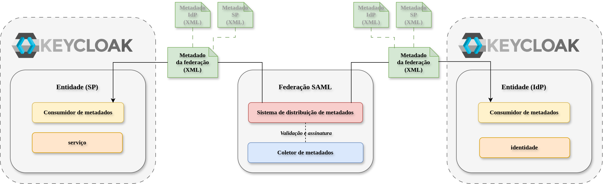

# Experimentação: Federar um Provedor de Serviço (SP) baseado em Keycloak

Esse diretório apresenta um ambiente de experimentação para o uso de SAML em uma federação de identidade. O objetivo é demonstrar como inserir entidades (SP e IdP) em uma federação SAML e como essas entidades podem interagir com outras entidades da federação.



## Especificação das funcionalidades
1) Inscrição do SP na federação
2) Inscrição do IdP na federação
3) Autenticação do usuário no IdP

## Especificação das tecnologias

| Papel           | Serviço     | Porta | Entity ID                                                                            |
| --------------- | ----------- | ----- | ------------------------------------------------------------------------------------ |
| Provedor de Serviço SAML   | Keycloak  | 8080  | http://localhost:8080/realms/WTG-SP           |
| Provedor de Identidade SAML    | Keycloak  | 8081  | http://localhost:8081/realms/WTG-IDP               |

## Prática de Experimentação
### Preparação do Ambiente
Subir as entidades:
```bash
docker-compose -f keycloak/docker-compose.yml up -d
```
### Configuração do provedor de serviço
#### Registrar SP na Federação
1. Crie o realm "WTG-SP" para definir as configurações do SP
2. Os metadados do SP podem ser acessados em http://localhost:8080/realms/WTG-SP/protocol/saml/descriptor
3. Faça o registro desses metadados no agregador de metadados da federação.

#### Registrar Federação no SP
Os metadados da federação devem ser registrados no SP para que ele possa se comunicar com a federação.

Pela interface gráfica não é possível fazer o registro dos metadados da federação no SP. É necessário fazer o registro via API ou via linha de comando.

Para isso se utiliza a rota:
```
POST http://localhost:8080/admin/realms/WTG-SP/identity-provider/instances
```
### Configuração do provedor de identidade
#### Registrar IdP na Federação
1. Crie o realm "WTG-IDP" para definir as configurações do IdP
2. Os metadados do IdP podem ser acessados em http://localhost:8081/realms/WTG-IDP/protocol/saml/descriptor
3. Faça o registro desses metadados no agregador de metadados da federação.

#### Registrar Federação no IdP
Os metadados da federação devem ser registrados no IdP para que ele possa se comunicar com a federação.

Pela interface gráfica não é possível fazer o registro dos metadados da federação no IdP. É necessário fazer o registro via API ou via linha de comando.

Para isso se utiliza a rota:
```
POST http://localhost:8081/admin/realms/WTG-IDP/clients
```

### Fluxo de autenticação

1. O usuário acessa o SP (http://localhost:8080/realms/WTG-SP/account) e seleciona o IdP de sua instituição de origem (registrado no agregador de metadados).
2. O SP redireciona o usuário para o IdP (WTG-IDP)
3. O usuário se autentica no IdP
4. O IdP redireciona o usuário para o SP
5. O SP redireciona o usuário para a aplicação
